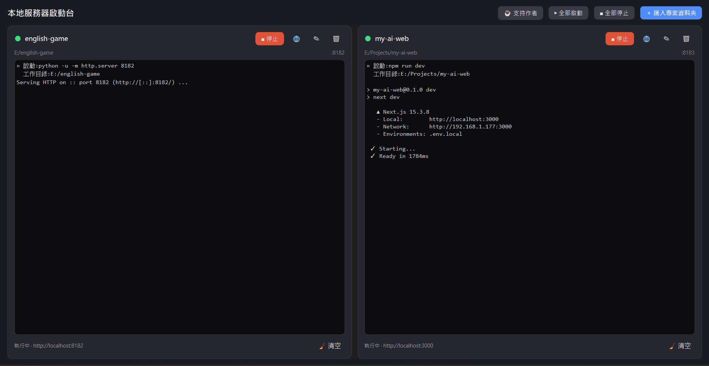

# 本地服務器啟動台 · Local Server Launcher

> 用 AI 生了一堆小網站 / 小工具,但每次要打開來看,還得開終端機、打指令、記 port、再手動開瀏覽器?
> 這個小工具把它變成**點一下就好**:匯入資料夾 → 按 ▶ 啟動 → 按 🌐 開瀏覽器。原生視窗、中文介面、零設定檔。

> Vibe-coding a bunch of little sites/apps with AI but tired of opening a terminal, typing commands,
> remembering ports, and opening the browser by hand every time? This tiny GUI makes it one click:
> import a folder → ▶ Start → 🌐 Open. Native window, no config files.



## ⬇️ 取得方式 / Get it

**🤖 最推薦(AI 開發者):把這個 repo 網址丟給你的 AI**(Claude Code / Cursor / Cline 等能執行指令的 AI)**叫它幫你裝** —— 連下載都免、**也不會跳任何安全警告**。詳見下方〈安裝與執行〉**方法 A**。

**💾 或:直接下載 Windows 版(免安裝、不需 Python)**

[](https://github.com/zxc02621948-sketch/server-launcher/releases/latest/download/server-launcher.exe)

> 第一次開啟會跳 SmartScreen「無法辨識的發行者」→ 點 **「其他資訊 → 仍要執行」** 即可(未簽章小工具的正常現象,不是病毒;本工具開源、程式碼公開可檢視)。不想看到警告?用上面的 **AI 安裝法**就沒有。

## 這是給誰用的 / Who it's for
- 用 AI 寫網站 / 小 app,但**不熟終端機**的人
- 同時在弄好幾個專案,想要一個地方**一鍵啟停、各自看日誌**
- 偏好**圖形介面**勝過記指令的人

## 功能 / Features
- 📁 匯入任何專案資料夾,**自動偵測啟動指令**(Next / Vite / Django / Flask / 靜態檔…)
- ▶️ 每個專案一張卡,獨立 **啟動 / 停止**,各自一塊黑底 console 看即時日誌
- 🌐 一鍵**在瀏覽器開啟** —— 會**自動從輸出抓真實網址**,不會開錯 port
- 🧹 清日誌、✎ 編輯(名稱 / 資料夾 / port / 指令)、🗑 移除
- ⏯️ **全部啟動 / 全部停止**
- 🪟 原生視窗(PySide6)、深色主題、**中英雙語**(依系統語言自動切換,工具列也有「中 / EN」鈕可手動切)
- 🌍 Bilingual UI (中文 / English) — auto-detects your system language, with a one-click toggle

## 安裝與執行 / Install & Run

### 🤖 方法 A(最推薦給 AI 開發者):叫你的 AI 幫你裝
你在用 Claude Code / Cursor / Cline 這類**能執行指令的 AI**?把下面這段複製給它,它就會幫你裝好並啟動 —— **不用下載 exe、不會跳 SmartScreen**:

```text
幫我安裝並執行這個工具:https://github.com/zxc02621948-sketch/server-launcher
它是 Python + PySide6 的桌面 GUI,請 clone 下來、執行 pip install -r requirements.txt,
再用 pythonw server_launcher.py 啟動。需要 Python 3.10+。
```

English — paste this to your AI coding agent:

```text
Install and run this tool for me: https://github.com/zxc02621948-sketch/server-launcher
It's a Python + PySide6 desktop GUI. Clone it, run `pip install -r requirements.txt`,
then start it with `pythonw server_launcher.py`. Requires Python 3.10+.
```

> 倉庫裡有 `AGENTS.md`,coding agent 會自動讀到安裝步驟,所以通常「丟網址 + 上面那句」就會成功。

### 💾 方法 B:直接下載 .exe(免安裝、不用 Python)
👉 **[點此下載 server-launcher.exe](https://github.com/zxc02621948-sketch/server-launcher/releases/latest/download/server-launcher.exe)** —— 雙擊就能用。
> 第一次開會跳 SmartScreen → 點「其他資訊 → 仍要執行」(不是病毒,開源可檢視)。下載頁的 `Source code (zip/tar.gz)` 一般使用者不用理它。

### 🧑‍💻 方法 C:自己用 Python 跑
```bash
pip install -r requirements.txt        # 安裝 PySide6
pythonw server_launcher.py             # 啟動(Windows 可改雙擊 啟動.vbs)
```
出問題想看錯誤訊息 → 雙擊 `偵錯.bat`。自己打包成 exe → 雙擊 `build.bat`(成品在 `dist\server-launcher.exe`)。

## 怎麼用 / Usage
1. **＋ 匯入專案資料夾** → 選資料夾,自動配 port 並偵測啟動指令
2. 每格 **▶ 啟動** / **🌐** 開瀏覽器 / **■ 停止**(連子程序一起關)
3. **✎** 編輯、**🗑** 移除、**🧹** 清日誌
4. **▶ 全部啟動 / ■ 全部停止**

> 小提醒:npm / Next / Vite 啟動要幾秒,**等 console 印出 `http://localhost:xxxx`(狀態列顯示該網址)再按 🌐**。

## 自動偵測規則
| 資料夾裡有 | 偵測到的指令 |
|---|---|
| `package.json` | `npm run dev`(沒 dev 就 `npm start`) |
| `manage.py` | `python manage.py runserver {port}`(Django) |
| `app.py` | `python app.py`(Flask / 一般 python) |
| `main.py` | `python main.py` |
| 其餘 | `python -u -m http.server {port}`(靜態檔) |

指令裡的 `{port}`、`{dir}` 會代換成該格的 port 與資料夾;用 `cmd /c` 執行,終端打得出來的都能跑。

## 跟其他工具的差別 / Honest comparison
已經有很強的免費工具,如 [mprocs](https://github.com/pvolok/mprocs)(終端 TUI)、[PM2](https://github.com/unitech/pm2)(Node 程序管理)。
**它們更強大,但都是終端 / CLI / 要寫設定檔。** 這個工具的定位不同:**給不熟終端機的人一個點一點就好的圖形介面**。如果你習慣 CLI,mprocs / PM2 可能更適合你。

## 需求 / Requirements
- Windows(stop 用 `taskkill`、無黑窗用 `pythonw`;其他平台可跑但這兩塊需微調)
- Python 3.10+ 與 PySide6(用 .exe 則免)

## ☕ 支持作者 / Support
這個工具是免費且開源的。如果它幫你省了麻煩,歡迎請我喝杯咖啡:
👉 https://ko-fi.com/kuanming

## 授權 / License
MIT — 詳見 [LICENSE](LICENSE)。
